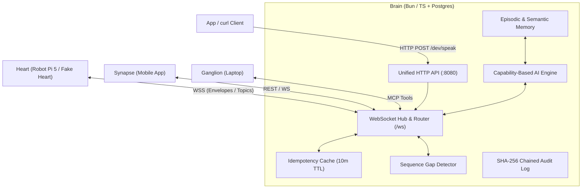

# MioBots Brain — The Cognitive Systems & AI Architecture Masterclass

> **Welcome to your personal AI & backend systems textbook!**  
> If you are learning TypeScript, distributed WebSocket architectures, LLM orchestration, or agentic robotics backends, this document was created for you. It explains the entire engineering foundation behind `miobots-brain`.

---

## Table of Contents
1. [The Big Picture: What is Brain?](#1-the-big-picture-what-is-brain)
2. [Brain Architectural Invariants & Authority Boundaries](#2-brain-architectural-invariants--authority-boundaries)
3. [Brain Core Subsystems & Directory Layout](#3-brain-core-subsystems--directory-layout)
4. [Mastering TypeScript & Systems Engineering Patterns in Brain](#4-mastering-typescript--systems-engineering-patterns-in-brain)
   - [Pattern 1: Async Correlation Tracking with Promises & Maps (`sendCommand`)](#pattern-1-async-correlation-tracking-with-promises--maps-sendcommand)
   - [Pattern 2: Capability Routing vs Vendor Coupling](#pattern-2-capability-routing-vs-vendor-coupling)
   - [Pattern 3: Type-Safe Envelope Dispatching with Generics](#pattern-3-type-safe-envelope-dispatching-with-generics)
   - [Pattern 4: Unified Error Classification Taxonomy](#pattern-4-unified-error-classification-taxonomy)
   - [Pattern 5: Unified HTTP & WebSocket Router Architecture](#pattern-5-unified-http--websocket-router-architecture)
   - [Pattern 6: Receiver-Side Idempotency Caching & Deduplication](#pattern-6-receiver-side-idempotency-caching--deduplication)
   - [Pattern 7: Sequence Gap Detection & Stale Telemetry Dropping](#pattern-7-sequence-gap-detection--stale-telemetry-dropping)
5. [Line-by-Line Subsystem Breakdown](#5-line-by-line-subsystem-breakdown)
   - [Subsystem 1: Configuration (`src/brain/config.ts`)](#subsystem-1-configuration-srcbrainconfigts)
   - [Subsystem 2: Unified HTTP Router & WebSocket Server (`src/brain/server.ts`)](#subsystem-2-unified-http-router--websocket-server-srcbrainserverts)
   - [Subsystem 3: Command Dispatcher & Correlation Tracker (`src/brain/hub.ts`)](#subsystem-3-command-dispatcher--correlation-tracker-srcbrainhubts)
   - [Subsystem 4: Idempotency Store & Expiry Reaper (`src/brain/command-store.ts`)](#subsystem-4-idempotency-store--expiry-reaper-srcbraincommand-storets)
   - [Subsystem 5: Per-Device Sequence Tracker (`src/brain/sequence-tracker.ts`)](#subsystem-5-per-device-sequence-tracker-srcbrainsequence-trackerts)
   - [Subsystem 6: Capability-Based AI Interface (`src/ai/`)](#subsystem-6-capability-based-ai-interface-srcai)
6. [Testing & Verification Protocol](#6-testing--verification-protocol)
7. [Brain Engineering Roadmap: What Comes Next?](#7-brain-engineering-roadmap-what-comes-next)

---

## 1. The Big Picture: What is Brain?

In the MioBots distributed architecture, **Brain is the cognitive core** — the central orchestrator responsible for reasoning, long-term memory retrieval, LLM task expansion, tool permissions, and system-wide state coordination.

### The Inviolable Law of Brain:
> **"Brain is the ONLY component allowed to make decisions, reason with LLMs, and expand multi-step tasks."**

- **Heart** (the robot) moves mass, enforces hardware safety, and owns physical sensor truth.
- **Synapse** (the mobile app) asks the human for confirmation and presents cards.
- **Ganglion** (desktop daemon) provides removable companion compute.
- **Brain** (cloud/server) receives telemetry and speech, queries memory, decides what actions to take, and dispatches commands over the WebSocket control plane.



---

## 2. Brain Architectural Invariants & Authority Boundaries

1. **Past vs. Future Authority:**
   - **Heart owns the past** (what physically happened to sensors and wheels).
   - **Brain owns the future** (intent, planning, goals).
   - *When they disagree about the present, the physical sensor event always wins.*
2. **Zero-Hallucination Grounding Floor:**
   - If episodic/semantic memory retrieval returns **0 rows**, the LLM is **never called** to invent an answer. Brain returns *"I have no record of that"* deterministically.
3. **Two-Tier Tool Approvals:**
   - **Read tools** (get location, check battery) execute autonomously.
   - **Action tools** (move physical items, open doors, trigger purchases) require explicit human confirmation through Synapse approval cards.
   - Every action appends to an append-only SHA-256 hash-chained `audit` table.
4. **Survives Disconnection:**
   - If Brain goes offline or loses internet, Heart continues autonomous local navigation, safety deadman monitoring, and cached local reminders without bricking.

---

## 3. Brain Core Subsystems & Directory Layout

```text
repos/miobots-brain/
├── src/
│   ├── ai/                      # AI abstraction & capability routing layer
│   │   ├── attachments/         # Multimodal resolvers (images, audio, PDF)
│   │   ├── providers/           # Vendor SDK isolation (Anthropic, Google, OpenAI-compatible)
│   │   ├── tools/               # Tool schema registry & execution engine
│   │   ├── client.ts            # High-level AI client API
│   │   ├── config.ts            # Capability tier configuration
│   │   ├── errors.ts            # Error taxonomy & classification
│   │   └── types.ts             # Domain AI interfaces
│   ├── brain/                   # Control plane & communication hub
│   │   ├── config.ts            # Runtime environment & ProtocolDefaults alignment
│   │   ├── command-store.ts     # 10-min Idempotency store & auto-cleanup reaper
│   │   ├── sequence-tracker.ts  # Per-connection packet gap & stale telemetry detector
│   │   ├── hub.ts               # Command Dispatcher & Correlation Tracker (sendCommand)
│   │   ├── server.ts            # HTTP API router (POST /dev/speak) & WebSocket server
│   │   └── index.ts             # Clean barrel exports
│   ├── db/                      # (Phase 2) Postgres schema & pgvector memory engine
│   └── index.ts                 # Package root entry point
├── tests/
│   └── unit/
│       ├── ai/                  # AI client, error, and attachment test suites
│       └── brain/               # Server, hub, idempotency, sequence, and dev-speak tests
├── bun.lock                     # Pinned Bun lockfile
└── package.json                 # Package manifests & scripts
```

---

## 4. Mastering TypeScript & Systems Engineering Patterns in Brain

---

### Pattern 1: Async Correlation Tracking with Promises & Maps (`sendCommand`)

When Brain sends a command to a remote robot over a duplex WebSocket, it cannot simply `await ws.send()`. `ws.send()` only means the bytes left the local network card; it does **not** mean the robot received, executed, or acknowledged the command.

**The Solution:**
```typescript
type PendingCommand = {
    device_id: string;
    idem_key: string;
    resolve: (ack: Envelope<string, unknown>) => void;
    reject: (error: Error) => void;
    timeout: ReturnType<typeof setTimeout>;
};

const pendingCommands = new Map<string, PendingCommand>();
```
1. `sendCommand()` creates a `corr_id` and registers `{ resolve, reject }` into `pendingCommands.set(corr_id, ...)`.
2. When the remote device replies with `Kind.ACK` carrying that exact `corr_id`, `handleAck(ack)` looks up the pending record, cancels the 5-second watchdog timer, deletes the tracking record, and calls `pending.resolve(ack)`.
3. If no ACK arrives within `config.timeout_ms` (5000 ms), the timer fires, removes the tracking record, and rejects the Promise with a clean timeout error.

---

### Pattern 2: Unified HTTP & WebSocket Router Architecture

In Node.js / Bun, rather than running separate HTTP and WebSocket ports, we attach `WebSocketServer` to a native `http.createServer`.

```typescript
export const httpServer = http.createServer((req, res) => {
    if (req.method === "POST" && req.url === "/dev/speak") {
        // Handle REST API request
    } else if (req.method === "GET" && req.url === "/health") {
        // Handle Health check
    }
});

export const wss = new WebSocketServer({
    server: httpServer,
    path: "/ws",
});
```
- **Port Economy:** Only a single port (`8080`) is exposed.
- **Protocol Demultiplexing:** Standard HTTP traffic is handled by `httpServer` request listeners, while WebSocket upgrade handshakes on `/ws` are seamlessly intercepted and managed by `WebSocketServer`.

---

### Pattern 3: Receiver-Side Idempotency Caching & Deduplication

In distributed networks, if an ACK packet is lost over Wi-Fi, the sender retries. Without protection, a robot would execute a command twice (e.g., spoken twice or driven twice).

```typescript
export function getExistingCommand(
    map: Map<string, CommandRecord>,
    idem_key: string,
): Promise<Envelope<string, unknown>> | undefined {
    const existing = map.get(idem_key);
    if (!existing) return undefined;

    if (existing.status === "pending") return existing.promise;
    if (existing.status === "resolved") return Promise.resolve(existing.ack!);
    // ...
}
```
- For an **in-flight** duplicate, Brain returns the active promise (sends only 1 wire message).
- For a **completed** duplicate within 10 minutes, Brain replays the cached ACK immediately without re-dispatching to the robot.

---

### Pattern 4: Sequence Gap Detection & Stale Telemetry Dropping

Each connected device tracks a monotonic `seq` number per session.
```typescript
const result = detector.evaluate(seq, kind);
if (result.gap) {
    console.warn(`[SERVER] SEQUENCE GAP: device=${deviceId} missing ${result.gapSize} message(s)`);
}
if (result.droppedOldTelemetry) {
    console.warn(`[SERVER] STALE TELEMETRY: dropped out-of-order packet`);
    return false;
}
```
- Catches lost packets before they corrupt application state.
- Automatically discards older telemetry packets (e.g. stale battery or pose) that arrive out of order.

---

## 5. Line-by-Line Subsystem Breakdown

### Subsystem 1: Configuration (`src/brain/config.ts`)
Imports `ProtocolDefaults` from `@miobots/protocol` to ensure default port (`8080`) and authentication tokens (`mio-dev-secret-token`) align with Fake Heart simulator out of the box.

### Subsystem 2: Unified HTTP & WS Server (`src/brain/server.ts`)
- Implements `POST /dev/speak` endpoint handling body parsing, size guards, device online checks, and `sendCommand()` resolution.
- Exposes `GET /health` with connected device list.
- Validates `sys.hello` against `DEV_TOKEN` and protocol version 1.

### Subsystem 3: Command Dispatcher (`src/brain/hub.ts`)
Handles `corr_id` tracking, 5000 ms timeout promises, and inbound ACK routing.

### Subsystem 4: Command Store (`src/brain/command-store.ts`)
Maintains per-device 10-minute idempotency caches with automatic periodic cleanup every 60 seconds.

### Subsystem 5: Sequence Tracker (`src/brain/sequence-tracker.ts`)
Wraps `@miobots/protocol`'s `SequenceGapDetector` to monitor packet continuity for each connected device.

---

## 6. Testing & Verification Protocol

Brain uses **Bun** as its package manager and test runner:

```bash
# Run full unit test suite (34 tests across 7 files)
cd repos/miobots-brain
bun test

# Run TypeScript strict typecheck
bun run typecheck
```

---

## 7. Brain Engineering Roadmap: What Comes Next?

| Task | Title | Description | Status |
| :--- | :--- | :--- | :--- |
| **`B0.0`** | Brain Repo Hygiene | Single Bun lockfile, delete empty protocol dirs, pin TS | ✅ **Done** |
| **`B0.1`** | Protocol Linking | Link `@miobots/protocol` with zero duplicate types | ✅ **Done** |
| **`B0.2`** | WebSocket Hub & Auth | Port 8080 `/ws` server with `sys.hello` token check | ✅ **Done** |
| **`B0.3`** | Command Dispatcher | `sendCommand()` with `corr_id`, `idem_key`, 5s timeout | ✅ **Done** |
| **`B0.5`** | Idempotency & Expiry | 10-min duplicate cache, payload size limit, expired reject | ✅ **Done** |
| **`B0.6`** | Sequence Tracker | Gap detection and stale telemetry dropping | ✅ **Done** |
| **`B0.4`** | ⛳ **Milestone I1** | `POST /dev/speak` 3-terminal live transport verification | ✅ **Done** |
| **`B1.1`** | AI Provider Polish | Close PR #4 items (fail taxonomy, retry policy, kind validation) | ⏳ Up Next (M1-W2) |
| **`B1.2`** | Tool Registry | Register `speak()`, `get_battery()`, `get_pose()` tools | ⏳ Up Next (M1-W2) |
| **`B1.3`** | Agent Core Loop | Conversational ReAct agent loop with 5-iteration cap | ⏳ Up Next (M1-W2) |
| **`B1.4`** | Brain v0 Acceptance | `POST /dev/utterance -d '{"text":"say salam in urdu"}'` | ⏳ Milestone ⛳ **I2** |
